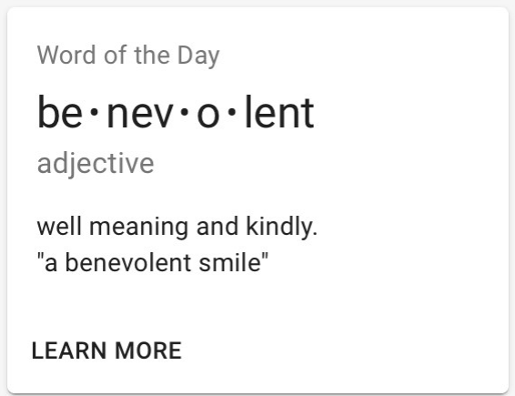

# Тестовое задание

## Общее описание

**Стэк технологий:** React + Redux + TypeScript

Создать Single Page Application, которое умеет показывать следующие страницы:

- `/` — главная
- `/login` — страница ввода логина и пароля
- `/cards` — страница с карточками для изучения иностранных слов
- `/profile` — страница с формой изменения профиля, недоступная без авторизации

Страница `/cards` на усмотрение кандидата может быть доступна всем либо только авторизованным пользователям.

## Требования к приложению

При проектировании SPA обязательно использовать React-компоненты.

Желательно придерживаться следующей иерархии компонентов:

- **Page** — непосредственно страница целиком
- **Header** — сюда можно закинуть какой-то фейк с профилем; данные для отображения должны прокидываться через props
- **Footer** — сюда можно закинуть какой-то фейк с контактами; данные для отображения должны прокидываться через props
- **Body** — содержит непосредственно полезную нагрузку, например список карточек или форму профиля
- **CardList** — через props принимает массив объектов с данными карточек; для рендера использует компонент Card
- **Card** — рендер карточки; всю необходимую информацию для рендера компонент должен принимать через props
- **EditView** — содержит форму для редактирования информации профиля, через props принимает массив полей профиля, для рендера использует компонент Field
- **Field** — рендер поля

### Контроль состояния

- `this.state`, `this.setState` — если выбран объектный вариант для компонентов
- Хук `React.useState` — если выбран функциональный вариант для компонентов

### Работа с данными

Всю работу с данными замокать:

- либо хардкодом в коде;
- либо, предпочтительнее, через специализированные сервисы, позволяющие мокать REST API, например:
  - Mockable
  - Postman Echo
  - или аналоги

## Уровни реализации задания

### Минимальный

Раздел карточек без авторизации.

### Нормальный

Минимальный уровень + форма авторизации и карточки скрыть за авторизацией.

### Полный

Все разделы.

# Описание страниц приложения

## Логин

Стандартная форма авторизации, центрированная по середине экрана.

Форма содержит:

- поле логина;
- поле пароля;
- кнопку «Войти».

В случае неправильных данных отображать сообщение, что вход невозможен — неправильный логин или пароль.

**Правильный логин/пароль:** `admin/admin`

## Главная

Отображает абстрактную информацию о проекте/приложении.

Вёрстка и состав информации — на усмотрение кандидата.

## Карточки

На экран выводится набор карточек для изучения английских слов.

Список слов можно зашить в константы приложения, но это должен быть массив.

Карточка представляет собой контейнер, содержащий информацию по слову.

Карточка должна содержать:

- **Заголовок** — какое-нибудь мотивирующее высказывание (в приведенном примере: `Word of the Day`), выбирается рандомно из предустановленных вариантов
- **Английское слово** — в приведенном примере `benevolent`
- **Пример его использования** — можно абракадабру
- **Кнопка с действием по карточке** — в приведенном примере `LEARN MORE`

При клике по кнопке действия карточка должна перевернуться и отобразить перевод английского слова.

Использование CSS-анимации будет плюсом, но необязательно.

При повторном клике по кнопке действия карточка опять переворачивается на лицевую сторону и отображает данные по английскому слову.

## Профиль

Отображается страница с формой для изменения данных пользователя.

Необходимо реализовать следующие требования:

- набор полей из 20 штук;
- названия полей на ваш вкус;
- обязательны поля следующих типов:
  - число;
  - строка;
  - текст;
  - дата;
  - выпадающий список;
  - группа checkbox-ов;
  - группа radio.

### Продвинутый уровень

Реализовать связь полей:

- при выборе в поле «а» определенного значения поле «б» скрывается;
- поле «в» становится недоступным для редактирования;
- в поле «в» помещается предустановленное значение.
